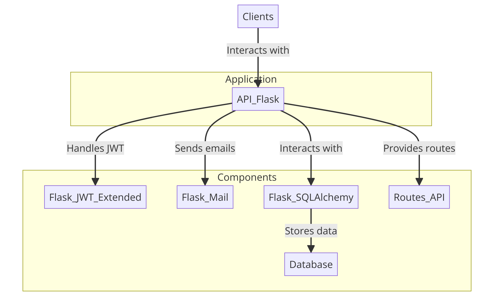
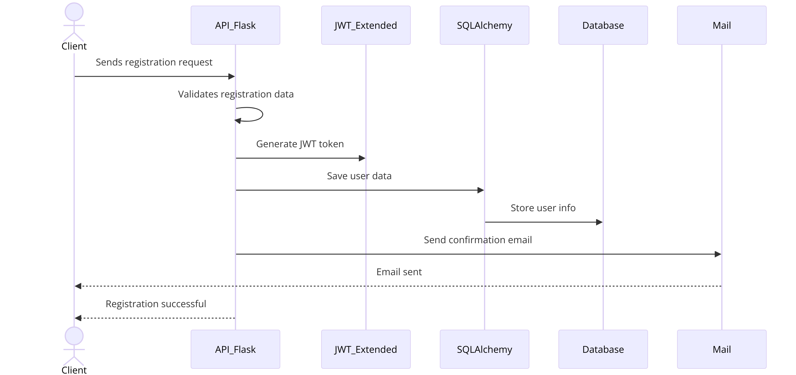
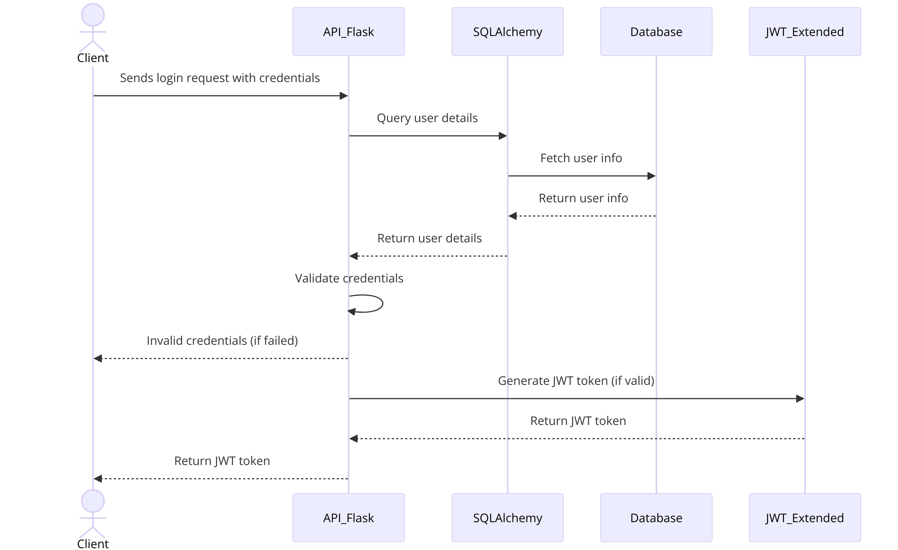
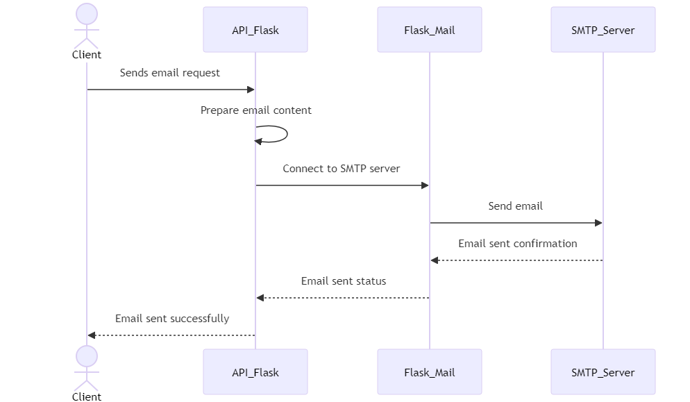
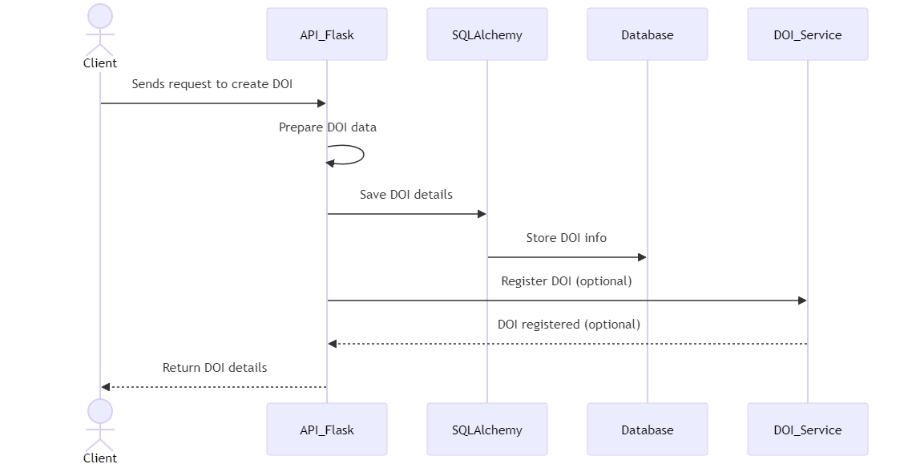
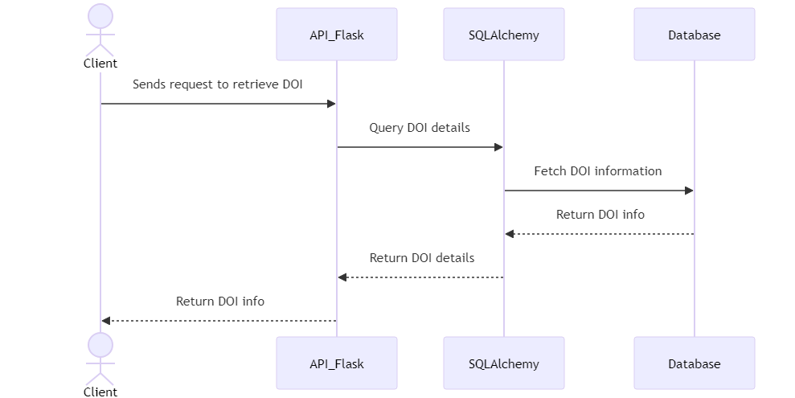
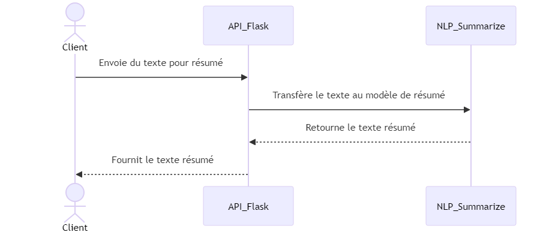
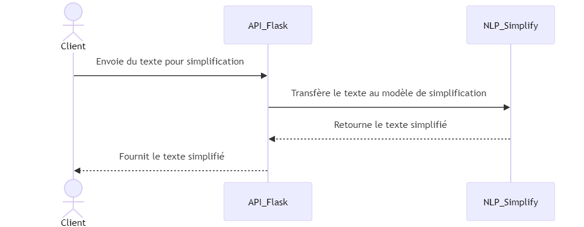

# API Commom

### Versions 
1.0 → Base (squelette API REST) Login + Register<br>
1.1 → DOI + Mail<br>
1.2 → Summarize + Simplify<br>


# Guide des API REST avec Flask

## Introduction aux API REST

Les API REST (Representational State Transfer) permettent aux applications de communiquer entre elles via le protocole HTTP. Elles sont largement utilisées pour interagir avec des services web, fournissant un moyen standardisé pour créer, lire, mettre à jour et supprimer des données (opérations CRUD).

## Architecture de l'Application Flask

L'application Flask inclut plusieurs composants clés : Flask pour le serveur web, Flask-JWT-Extended pour la gestion des tokens JWT, Flask-Mail pour l'envoi d'e-mails, et Flask-SQLAlchemy pour l'interaction avec la base de données SQL. Les Blueprints sont utilisés pour organiser les routes sous un chemin commun.

## Diagramme de l'Architecture

Le diagramme ci-dessous illustre comment les différents composants de l'application Flask interagissent entre eux.


## Illustration des Routes et des Fonctionnalités

### Enregistrement des Utilisateurs

Le diagramme ci-dessous montre comment la route `/common/api/v1/enregistrement-des-utilisateurs` fonctionne.



### Connexion des Utilisateurs

Le diagramme ci-dessous montre comment la route `/common/api/v1/connexion-des-utilisateurs` fonctionne.


### Envoi d'Email

Le diagramme ci-dessous montre comment la route `/common/api/v1/envoi-d'email` fonctionne.


### Création de DOI

Le diagramme ci-dessous montre comment la route `/common/api/v1/création-de-doi` fonctionne.


### Récupération d'un DOI

Le diagramme ci-dessous montre comment la route `/common/api/v1/récupération-d'un-doi` fonctionne.


### Résumé de Texte

Le diagramme ci-dessous montre comment la route `/common/api/v1/résumé-de-texte` fonctionne.


### Simplification de Texte

Le diagramme ci-dessous montre comment la route `/common/api/v1/simplification-de-texte` fonctionne.


## Fonctionnalités Spécifiques

Les fonctionnalités suivantes sont intégrées dans l'application Flask :
- Gestion des tokens JWT pour sécuriser les routes protégées.
- Envoi d'e-mails via le serveur SMTP configuré.
  - Gestion des DOI pour créer et résoudre les identifiants numériques.
- Utilisation de modèles NLP pour le résumé et la simplification des textes.

## Exemples de Requêtes API

Voici comment vous pouvez tester les différentes routes API en utilisant `curl` :

- **Enregistrement** :
  ```bash
  curl -X POST http://localhost:5000/common/api/v1/register -H "Content-Type: application/json" -d '{"username": "testuser", "password": "testpass"}'

- **Connexion** :
  ```bash
  curl -X POST http://localhost:5000/common/api/v1/login -H "Content-Type: application/json" -d '{"username": "testuser", "password": "testpass"}'

- **Envoie de mail** :
  ```bash
    curl -X POST http://localhost:5000/common/api/v1/send-mail -H "Authorization: Bearer <your_token>" -H "Content-Type: application/json" -d '{"recipient": "email@example.com", "subject": "Test", "body": "This is a test email."}'

- **Génération d'un DOI** :
  ```bash
    curl -X POST http://localhost:5000/common/api/v1/doi \
    -H "Authorization: Bearer <your_token>" \
    -H "Content-Type: application/json" \
    -d '{
      "prefixe": "10.1234",
      "titre": "Titre de l\'article",
      "auteur": "Nom de l\'auteur",
      "date": "2024-06-19",
      "type": "article"
    }'

- **Recherche d'un DOI** :
  ```bash
    curl -X GET http://localhost:5000/common/api/v1/doi/get/10.1234/abcdef \
    -H "Authorization: Bearer <your_token>"

- **Simplification d'un Texte** :
  ```bash
    curl -X POST http://localhost:5000/common/api/v1/simplify \
    -H "Authorization: Bearer <your_token>" \
    -H "Content-Type: application/json" \
    -d '{
      "text": "Les technologies de traitement automatique du langage naturel (NLP) ont considérablement évolué, offrant des solutions sophistiquées pour transformer de longs textes en résumés concis."
    }'

- **Résumé d'un Texte** :
  ```bash
  curl -X POST http://localhost:5000/common/api/v1/summarize \
    -H "Authorization: Bearer <your_token>" \
    -H "Content-Type: application/json" \
    -d '{
      "text": "Les technologies de traitement automatique du langage naturel (NLP) ont considérablement évolué, offrant des solutions sophistiquées pour transformer de longs textes en résumés concis. Parmi les leaders dans ce domaine, les API d'OpenAI, Hugging Face et Google Cloud se distinguent par leurs capacités et leurs fonctionnalités uniques. Voici un aperçu détaillé des avantages de chaque service et comment choisir celui qui convient le mieux à vos besoins."
    }'

